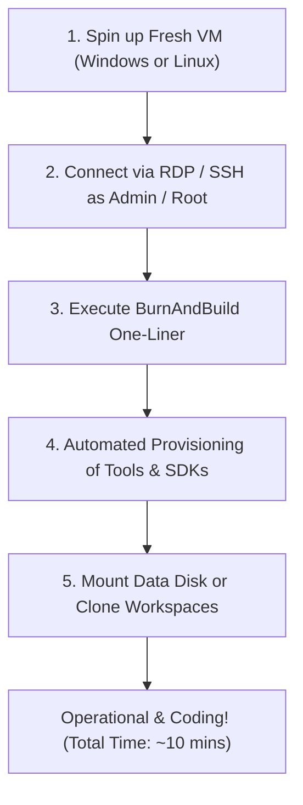

# BurnAndBuild Disaster Recovery Playbook: From Expired VM to Operational in 10 Minutes

When your trial or disposable VM expires, **Burn** the old instance and **Build** the new one fresh using the BurnAndBuild automation engine.

---

## The 5-Step Rapid Recovery Protocol



---

### Step 1: Deploy Fresh VM
- **Windows**: Windows 11 Pro / Enterprise or Windows Server 2022/2025 Datacenter.
- **Linux**: Ubuntu 22.04 / 24.04 LTS, Debian 12, or Fedora 39+.
- **Recommended Size**: 4 to 8 vCPUs, 16GB+ RAM (especially for Android build-tools & Docker).
- **Disk**: 64GB+ OS Disk.

---

### Step 2: Open Terminal with Admin / Root Rights
- **Windows**: Press `Win + X`, then press `A` (PowerShell as Administrator).
- **Linux**: SSH into your VM and run as `sudo` or root.

---

### Step 3: Execute the BurnAndBuild One-Liner

#### On Windows:
```powershell
Set-ExecutionPolicy Bypass -Scope Process -Force; [System.Net.ServicePointManager]::SecurityProtocol = [System.Net.SecurityProtocolType]::Tls12; $repo = "$env:TEMP\BurnAndBuild"; git clone https://github.com/<your-username>/BurnAndBuild.git $repo; cd $repo; .\burnandbuild.ps1 -Full
```

*Or, if files are downloaded locally on Windows:*
```powershell
Set-ExecutionPolicy Bypass -Scope Process -Force
cd "C:\Path\To\BurnAndBuild"
.\burnandbuild.bat
```

#### On Linux:
```bash
git clone https://github.com/<your-username>/BurnAndBuild.git /tmp/BurnAndBuild && cd /tmp/BurnAndBuild && sudo ./burnandbuild.sh --full
```

*Or, interactive mode on Linux:*
```bash
cd /tmp/BurnAndBuild
sudo ./burnandbuild.sh
```

---

### Step 4: Mount Persistence & Restore Identity

#### Windows:
1. **If using Secondary Detached Disk:**
   ```powershell
   Get-Disk | Where-Object IsOffline | Set-Disk -IsOffline $false
   ```
2. **If restoring from Git:**
   - Clone your project repositories into `C:\Workspace`:
     ```powershell
     cd C:\Workspace
     git clone git@github.com:my-org/my-project.git
     ```

#### Linux:
1. **If using Secondary Cloud Volume:**
   ```bash
   sudo mkdir -p /workspace
   sudo mount /dev/sdb1 /workspace
   ```
2. **If restoring from Git:**
   ```bash
   cd /workspace
   git clone git@github.com:my-org/my-project.git
   ```

---

### Step 5: Verification & Launch

Run the health check to verify all runtimes and tools are active:

#### Windows:
```powershell
.\tests\Verify-Installation.ps1
code C:\Workspace
```

#### Linux:
```bash
./tests/verify-installation.sh
code /workspace
```

You are now 100% operational!
