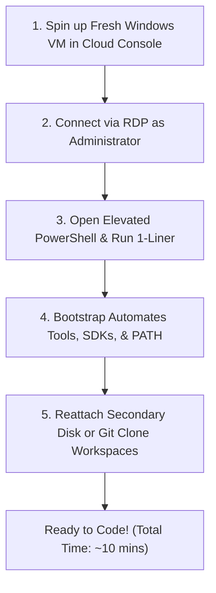

# Disaster Recovery Playbook: From Fresh VM to Ready Dev Environment in 10 Minutes

When your current trial VM expires, follow this exact step-by-step checklist.

---

## The 5-Step Rapid Recovery Protocol



---

### Step 1: Deploy Fresh VM
- **Image**: Windows 11 Pro / Enterprise or Windows Server 2022/2025 Datacenter.
- **Recommended Size**: 4 to 8 vCPUs, 16GB+ RAM (especially for Android build-tools & Docker).
- **Disk**: 64GB+ OS Disk.

---

### Step 2: Open PowerShell as Administrator
Press `Win + X`, then press `A` (Windows Terminal / PowerShell as Administrator).

---

### Step 3: Execute the Universal One-Liner

If your automation scripts are hosted on your GitHub / GitLab repository:

```powershell
Set-ExecutionPolicy Bypass -Scope Process -Force; [System.Net.ServicePointManager]::SecurityProtocol = [System.Net.SecurityProtocolType]::Tls12; $repo = "$env:TEMP\VM-Tool"; git clone https://github.com/<your-username>/windows-dev-bootstrap.git $repo; cd $repo; .\bootstrap.ps1 -Full
```

*Or, if bootstrapping without Git pre-installed:*
```powershell
Set-ExecutionPolicy Bypass -Scope Process -Force; [System.Net.ServicePointManager]::SecurityProtocol = [System.Net.SecurityProtocolType]::Tls12; Invoke-WebRequest -Uri "https://raw.githubusercontent.com/<your-username>/windows-dev-bootstrap/main/bootstrap.ps1" -OutFile "$env:TEMP\bootstrap.ps1"; & "$env:TEMP\bootstrap.ps1" -Full
```

*Or, if files are downloaded locally:*
```powershell
Set-ExecutionPolicy Bypass -Scope Process -Force
cd "C:\Path\To\VM-Tool"
.\bootstrap.ps1 -Full
```

---

### Step 4: Mount Persistence & Restore Identity

1. **If using Secondary Detached Disk:**
   - Attach data volume in cloud console.
   - Run in PowerShell:
     ```powershell
     Get-Disk | Where-Object IsOffline | Set-Disk -IsOffline $false
     ```
2. **If restoring from Git:**
   - Add your SSH key:
     ```powershell
     notepad $env:USERPROFILE\.ssh\id_ed25519
     ```
   - Clone your project repositories into `C:\Workspace`:
     ```powershell
     cd C:\Workspace
     git clone git@github.com:my-org/my-project.git
     ```

---

### Step 5: Verification & Launch

Run the health check to verify all runtimes and tools are active:

```powershell
.\tests\Verify-Installation.ps1
```

Launch your tools:
```powershell
code C:\Workspace
```

You are now 100% operational!
