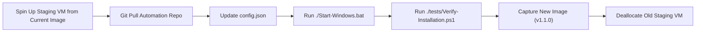

# BurnAndBuild Golden Image & Master VM Guide (Windows & Linux)

This guide explains how to convert a configured BurnAndBuild development environment into a reusable **Golden Master Image** across major cloud platforms (Azure, AWS, GCP) and hypervisors (Hyper-V, Proxmox, KVM).

---

## 1. Golden Image Concepts: Sysprep vs. Direct Snapshot

| Approach | Best For | Pros | Cons |
| :--- | :--- | :--- | :--- |
| **Sysprep + Managed Image** | Multi-VM scaling, distribution across accounts/regions, official templates. | Strips SIDs, computer names, clean OOBE setup. | Destroys the source VM; user accounts need recreation unless unattended answer file is used. |
| **Direct VM Snapshot / Disk Snapshot** | **Personal disposable free-trial VMs** | **Zero reconfiguration needed.** Keeps user profile, desktop shortcuts, credentials, and open projects. | Cannot be safely cloned 100 times simultaneously on the same corporate Active Directory domain (not an issue for isolated dev VMs). |

> [!TIP]
> **For Personal Disposable Dev VMs:** Direct disk snapshots or non-generalized images are usually **much faster** because they preserve your exact user profile (`C:\Users\<user>`), terminal configuration, and installed desktop shortcuts without forcing you through Windows Out-Of-Box Experience (OOBE) setup.

---

## 2. Cloud Provider Workflows

### A. Microsoft Azure

#### Option 1: Direct Disk Snapshot (Recommended for Personal Dev VM)
1. Stop/Deallocate the VM in Azure Portal:
   ```powershell
   Stop-AzVM -ResourceGroupName "MyDevRG" -Name "MyDevVM"
   ```
2. Create a Snapshot of the OS Disk:
   ```powershell
   $vm = Get-AzVM -ResourceGroupName "MyDevRG" -Name "MyDevVM"
   $snapshotConfig = New-AzSnapshotConfig -SourceUri $vm.StorageProfile.OsDisk.ManagedDisk.Id -Location $vm.Location -CreateOption Copy
   New-AzSnapshot -ResourceGroupName "MyDevRG" -SnapshotName "DevVM-GoldenSnapshot-v1" -Snapshot $snapshotConfig
   ```
3. When the old VM expires: Create a Managed Disk from the snapshot and deploy a new VM with that OS disk attached.

#### Option 2: Azure Compute Gallery / Generalized Image
1. Run Sysprep inside the VM:
   ```powershell
   & "C:\Windows\System32\Sysprep\sysprep.exe" /generalize /oobe /shutdown
   ```
2. In Azure CLI / Cloud Shell:
   ```bash
   az vm deallocate --resource-group MyDevRG --name MyDevVM
   az vm generalize --resource-group MyDevRG --name MyDevVM
   az image create --resource-group MyDevRG --name DevVM-GoldenImage-v1 --source MyDevVM
   ```

---

### B. Amazon Web Services (AWS EC2)

1. Run the bootstrap script inside the EC2 Windows instance.
2. If generalizing with EC2Launch v2:
   - Run: `& "C:\ProgramData\Amazon\EC2Launch\launch.exe" sysprep`
   - Or for direct AMI without sysprep (keeps user profile):
3. Create AMI from AWS CLI or Console:
   ```bash
   aws ec2 create-image \
       --instance-id i-0123456789abcdef0 \
       --name "Windows-Dev-Golden-v1.0" \
       --description "Pre-baked Windows 11 Dev Environment with Java, Python, Node, Android SDK" \
       --no-reboot
   ```
4. When old VM expires:
   ```bash
   aws ec2 run-instances \
       --image-id ami-xxxxxxxxx \
       --instance-type t3.xlarge \
       --key-name my-key \
       --security-group-ids sg-xxxxxxxxx
   ```

---

### C. Google Cloud Platform (GCP Compute Engine)

1. Stop the instance:
   ```bash
   gcloud compute instances stop dev-windows-vm --zone=us-central1-a
   ```
2. Create a custom image from the stopped VM's boot disk:
   ```bash
   gcloud compute images create windows-dev-golden-v1 \
       --source-disk=dev-windows-vm \
       --source-disk-zone=us-central1-a \
       --family=windows-dev
   ```
3. Deploy new VM from custom image:
   ```bash
   gcloud compute instances create dev-windows-vm-2 \
       --image-family=windows-dev \
       --machine-type=e2-standard-4 \
       --zone=us-central1-a
   ```

---

### D. Hyper-V / Local / Proxmox

- **Hyper-V**:
  1. Shut down the VM.
  2. Copy the `.vhdx` file to a safe location (`D:\VM-Templates\Golden-WinDev.vhdx`).
  3. When creating a new VM, create a **Differencing Disk** based on `Golden-WinDev.vhdx`. This creates a new VM in **3 seconds** using only a few megabytes of initial disk space!
- **Proxmox**:
  1. Stop VM -> Right click -> **Convert to Template**.
  2. To create a new VM -> Right click Template -> **Clone** (Linked Clone takes 5 seconds).

---

## 3. How to Update the Master Image (Bake Pipeline)

When a new tool is needed (e.g., adding Docker Desktop or upgrading Java 17 to Java 21):



1. **Deploy temporary VM** from existing Golden Image `v1.0`.
2. Open PowerShell in repo folder and run `git pull`.
3. Modify `config.json` with the new tool/version.
4. Execute `.\Start-Windows.bat` (or `.\scripts\bootstrap.ps1`).
5. Run `.\tests\Verify-Installation.ps1` to confirm health.
6. Clean temporary files:
   ```powershell
   Clear-RecycleBin -Force -ErrorAction SilentlyContinue
   Remove-Item -Path "C:\Windows\Temp\*" -Recurse -Force -ErrorAction SilentlyContinue
   Remove-Item -Path "$env:TEMP\*" -Recurse -Force -ErrorAction SilentlyContinue
   ```
7. Capture the new image as `v1.1` and deprecate `v1.0`.
